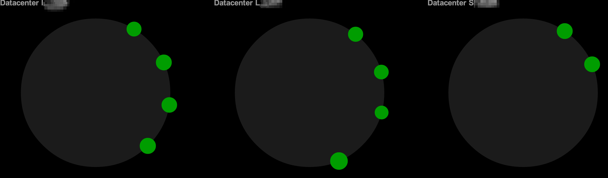

## Agenda

1. whoami
1. What is Cassandra
1. Glossary
1. Data Modeling
1. Anti Patterns
1. Links
1. Code

~~~~
## whoami

Jeff Beck

beckje01 on [GitHub](https://github.com/beckje01) and [Twitter](https://twitter.com/beckje01)

TechLead at ReachLocal

~~~~
## What is Cassandra

  * Highly-Available, Distributed, Tuned Consistency
  * Master-less Replication
  * Redundancy Configurable
  * Cluster can span DCs
~~
### Consistency

Great talk on Cassandra consistency, _Eventual Consistency != Hopeful Consistency_

[Video](http://www.youtube.com/watch?v=A6qzx_HE3EU)
[Slides](http://www.slideshare.net/planetcassandra/c-summit-2013-eventual-consistency-hopeful-consistency-by-christos-kalantzis)

~~
## Redundancy Configurable

```
CREATE KEYSPACE CassandraKeySpace  WITH REPLICATION = {'class' : 'SimpleStrategy', 'replication_factor': 1};
```
[ReadMore](http://www.datastax.com/documentation/cassandra/2.0/cassandra/architecture/architectureDataDistributeReplication_c.html)

~~
### Cluster can span DCs


~~~~
## Glossary

  * [CAP Theorem](http://en.wikipedia.org/wiki/CAP_theorem) - Consistency, Availability, and Partition tolerance
  * Cluster, DataCenter, Rack
  * Partitioner
  * Thrift
  * Quorum, Local Quorum

~~
## Glossary

  * DSE
  * Node Discovery
  * Load Balancing
  * [Replication Strategy](http://www.datastax.com/documentation/cassandra/2.0/cassandra/architecture/architectureDataDistributeReplication_c.html)
  * [Snitches](http://www.datastax.com/documentation/cassandra/2.0/cassandra/architecture/architectureSnitchesAbout_c.html)

~~~~
## CQL

CQL 3 is current highest version available in Cassandra is CQL3.1 available in Cassandra 2.0

CQL is the query language that is like SQL but not really.

~~~~
## Data Modeling in Cassandra

Model what you want to query for not the data.

This part is hard there will be mistakes.
~~
### Hints

  * Duplicate Data
  * Good Compound Primary Key
  * Careful around adding an index
  * Hire a Consultant

~~
## Primary Key

 * Defined as `PRIMARY KEY (lastName,firstName)`
 * Can query parts going left to right but no skipping.

~~
### Subscription Example  

```
CREATE KEYSPACE subscriptionapi WITH replication = {
  'class': 'NetworkTopologyStrategy',
  'WH2RT': '1',
  'WHRT': '1'
};

CREATE TABLE Subscription(
     id uuid,
     cid varchar,
     state varchar,
     startDate timestamp,
     endDate timestamp,
     product varchar,
     PRIMARY KEY (id)

);

Create index cid_key on subscription(cid);
```
~~
## Our Fix

```
CREATE TABLE subscription(

     id uuid,
     cid varchar,
     state varchar,
     startDate timestamp,
     endDate timestamp,
     product blob,
    PRIMARY KEY (id)
);

CREATE TABLE customersubscription(

     cid varchar,
     subscriptions List<uuid>,
    PRIMARY KEY (cid)
);
```
~~~~
## Anti Patterns

  * Read Before Write
  * Load Balancer
  * Excessive Heap Space
  * Use of order-preserving partitioner

[Slides](http://www.slideshare.net/mattdennis/strangeloop-2012-apache-cassandra-anti-patterns)

~~~~
## Links

  * [Current Docs](http://www.datastax.com/documentation/cassandra/2.0/cassandra/gettingStartedCassandraIntro.html)
  * [Java Driver GitHub](https://github.com/datastax/java-driver)
  * [SandBox](http://www.datastax.com/what-we-offer/products-services/sandbox)
  * [Scott Hirleman](https://twitter.com/shirleman) - Lots of good retweets of videos, slides, etc.

~~~~
# Code

~~~~
## Creation Keyspace & Table

```
CREATE KEYSPACE Simple
        WITH REPLICATION = {'class' : 'SimpleStrategy',
                            'replication_factor': 1};

CREATE TABLE Person (
     firstName varchar,
     lastName varchar,
     age int,
    PRIMARY KEY (lastName,firstName)
);
```
~~
## Inserts
```
insert into person (firstname, lastname, age) values ('Jeff','Beck',30) ;
insert into person (firstname, lastname, age) values ('Bob','Beck',60) ;
```
~~
## Table with list
```
create table alist (
 page varchar,
 visits list <timestamp>,
 PRIMARY KEY(page)
);
```
~~
### Append Item to list
```
update alist set visits=visits+['2014-04-14 19:34:20-0500'] where page='/fake' ;
```
~~~~
## Working with Query Builder
```
Update.Assignments updateAssignments = QueryBuilder.update(keyspaceName, table).with();

for (PersistentProperty prop : persistentEntity.getPersistentProperties()){
  updateAssignments = updateAssignments.and(QueryBuilder.set(prop.getName(), convertToCassandraType(entry.get(prop.getName()))));
}

Statement update = updateAssignments.where(QueryBuilder.eq("id", UUID.fromString(uuid.toString())));

session.execute(update);
```
~~
```
## Pull out java serialized object
ByteBuffer bb = row.getBytes(columnName);
byte[] result = new byte[bb.remaining()];
bb.get(result);

ByteArrayInputStream byteArrayInputStream = new ByteArrayInputStream(result);
ObjectInputStream ois = new ObjectInputStream(byteArrayInputStream);
o = ois.readObject();  
```
