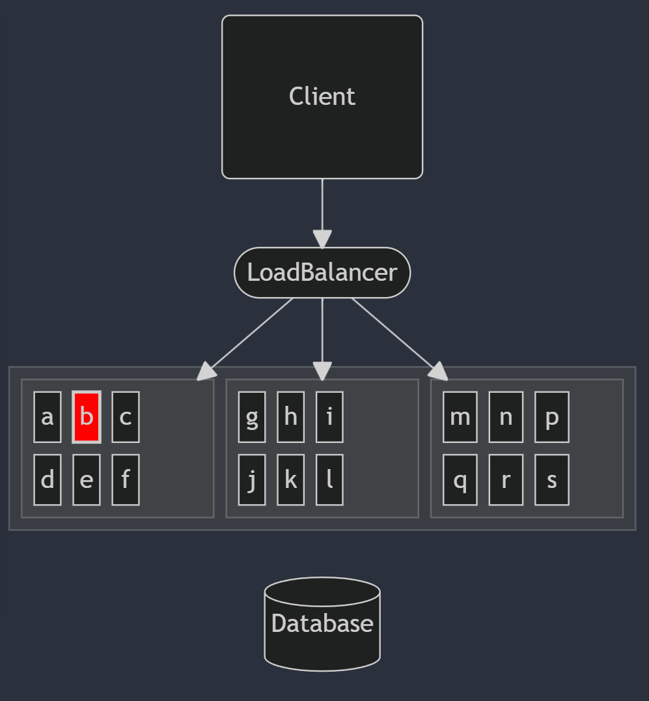
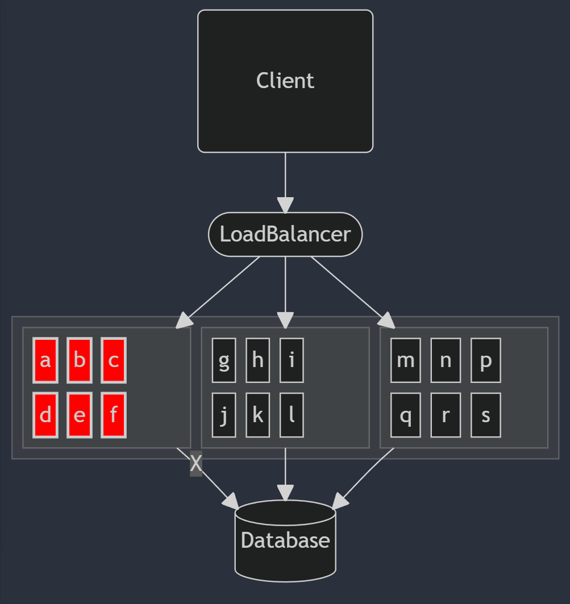
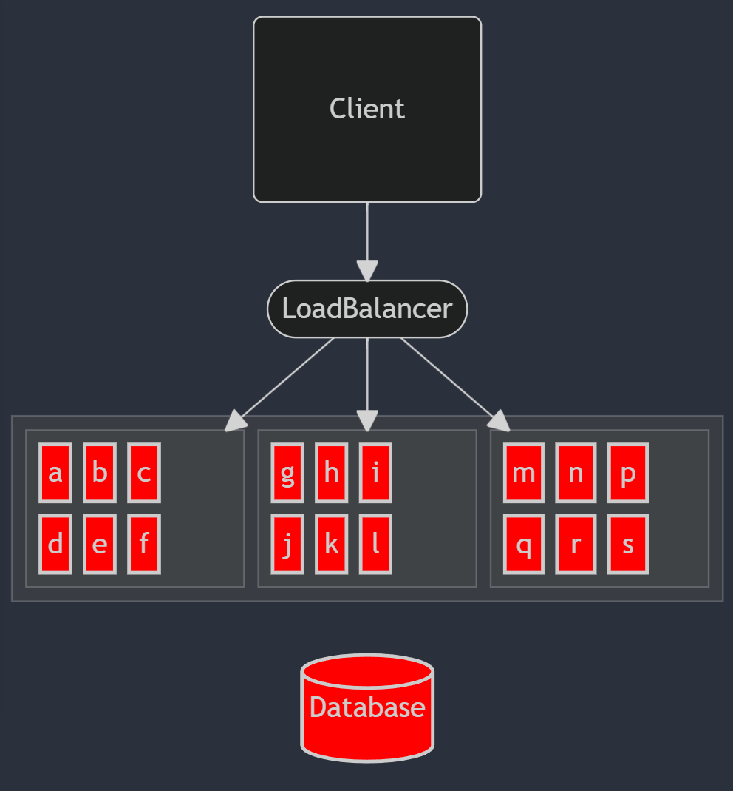

### Agenda

 * whoami
 * Definitions
 * Mental Model
 * Properties of a Healthcheck
 * Demo - What do they look like?
 * What are they good for?
 * Healthcheck Patterns

----
### $ whoami

Jeff

@beckje01

----
### Warnings

I would consider this a work in progress. Please give flow and materials feedback.

*Stop me and ask terms you don't know.*

----
### Definitions 

 * *Healthcheck* - Action that confirms some bit of functionality
 * *Heartbeat* - Message sent out
 * *Healthcheck Endpoint* - An where you read the state of healthchecks.

---
### Deep vs Shallow Healthcheck

AWS will use these terms in their documentation.

- *Deep* - Checks off box dependencies
- *Shallow* - Checks on box dependencies

---
### Heartbeat vs Healthcheck?

 * Heartbeat is pushed out from a μService
 * Healthcheck is something you read from a μService
 * Heartbeats are usecase specific

-note
A heartbeat is where the microservice calls out or pushes data / messages out of a known  channel many times it can also be used to keep a long lived connection working. Kept in a thread it doesn't typically expose how the service is doing just the simple fact that it is still doing stuff.

I've always found it better to treat a heartbeat as outbound and a healthcheck endpoint an inbound read.

 * Payload of a heartbeat may include protected information.

----
### Mental Model

The healthcheck represent a single instance. Not the health of your whole application. 



-note 
It's good to talk about the difference between a health check versus what you get from like metrics across the entire fleet of an application 

---
### Mental Model

A set of nodes with a shared dependency can easily cause a group issue.


---
### Mental Model

A single shared dependency can lead to full failure.



----
### Properties of a Healthcheck

* Checks a single condition
* Reflects the state of the health when possible
* No Side Effects
* Represents a value for a given service

----
### Healthcheck Endpoint

* Unauthenticated 
* Must not generate load with repeated calls.
* Must represent if the μService can do work. 
* Aggregates the healthchecks of a μService
---
### What does that mean?

* Don't share sensitive details.
* Reflect state don't go check it.
* You will get called a lot.
* You depend on the properties of the healthchecks to keep your system safe.
* The logic of understanding if you are healthy or not is typically done here.

----
### Demo - What do they look like?

NestJS - Book CRUD

https://github.com/beckje01/book-crud/tree/health

-note

```
docker ps

docker pause book-crud_devcontainer-db-1

docker unpause book-crud_devcontainer-db-1

curl localhost:3000/health | jq

watch -n .1 --color 'curl http://localhost:3000/health | jq -C .'
```
---
### Demo - NestJS

- [Healthcheck Recipes](https://docs.nestjs.com/recipes/terminus)
- [Samples](https://github.com/nestjs/terminus/tree/master/sample)
- [Example Fix](https://github.com/nestjs/terminus/pull/2548/files)

-note

We can see the fix is reusing DB connection but that means that every healthcheck call was doing work. 

----
### What are they good for?

- Traffic Routing
- Deployments 
- Instance Lifecycle <i>Need Better Name</i>
- Debugging

-note

Only route traffic to systems that can serve the traffic

Using healthchecks will allow you to correctly do Blue / Green deployments

terminate bad instances 

debug single box failures

----
### K8S Example

Consider these different use cases of healthcheck endpoints. 

- Liveness Probe
- Readiness Probe
- Startup Probe

<hr/>

See the [K8S Documentation for more details](https://kubernetes.io/docs/concepts/configuration/liveness-readiness-startup-probes/).

---
### K8S Liveness Probe (Deployment / Lifecycle)

A simple [HTTP Probe](https://kubernetes.io/docs/reference/generated/kubernetes-api/v1.31/#httpgetaction-v1-core) that checks for the status from the HTTP GET. Failed pods will be *terminated*.

> Any code greater than or equal to 200 and less than 400 indicates success. Any other code indicates failure.

```yaml
apiVersion: v1
kind: Pod
metadata:
  name: liveness-http
spec:
  containers:
  - name: liveness
    image: your/container:1
    livenessProbe:
      httpGet:
        path: /health-check
        port: 80
      initialDelaySeconds: 3
      periodSeconds: 3

```

[See K8S Documentation](https://kubernetes.io/docs/tasks/configure-pod-container/configure-liveness-readiness-startup-probes/#define-a-liveness-http-request)

--- 
### K8S Readiness Probe (Traffic)

Configure your health check endpoint to accept a query parameter that will adjust the HTTP status code based on the type of probe you are calling. Failed pods will not get traffic.

-note

You can reuse the config above but for a readinessProbe instead of liveness

---
### K8S Startup Probe (Deployment)

A special case probe that disables Readiness and Liveness Probes until it passes.

Use this to address:

- Cold Start
- Prefetch Caching
- Expensive Security 

-note

Special case of checking more deep checks then normal liveness

----
### AWS 

AWS splits traffic routing and lifecycle apart.

- [Elastic Load Balancing - LB](https://docs.aws.amazon.com/elasticloadbalancing/) 
- [Auto Scale Groups - ASG](https://docs.aws.amazon.com/autoscaling/ec2/userguide/get-started-with-ec2-auto-scaling.html)

---
### AWS - LB (Traffic)

There are a few flavors of LoadBalancers in AWS.

They all support a form of healthcheck that allow it to only route traffic to healthy instances.

---
### AWS - Classic Load Balancer

Levers:

- *Response Timeout* - How long to wait.
- *Healthcheck Interval* - How often to check
- *Unhealthy Threshold* - How many consecuitve failures to be unhealthy
- *Healthy Threshold* - How many pass checks to be healthy

[Docs](https://docs.aws.amazon.com/elasticloadbalancing/latest/classic/elb-healthchecks.html)

-note

How responive to failure you are is determined here

Default: 
if you require 2 unhealthy checks and only check every 30 seconds it takes a minute of downtime to pull it from the LB

---
### AWS -- Applicatoin Load Balancer

Levers:

- *Response Timeout* - How long to wait.
- *Healthcheck Interval* - How often to check
- *Unhealthy Threshold* - How many consecuitve failures to be unhealthy
- *Healthy Threshold* - How many pass checks to be healthy
- *Matcher* - Status code to consider healthy

[Docs](https://docs.aws.amazon.com/elasticloadbalancing/latest/application/target-group-health-checks.html)

-note 

Very similar to classic as far as health goes with one extra bit

---
### AWS - Auto Scale Groups (Lifecycle)

- EC2 Status Check
- EBS Health Checks
- Elastic Load Balancing Health Check 
- VPC Lattice
- Custom

[Docs](https://docs.aws.amazon.com/autoscaling/ec2/userguide/health-checks-overview.html)

-note

Easy for the frist 2

but ELB means if it dosen't take traffic it is terminiated

---
### AWS ASG

How to save an instance(s)

- Suspend HealthCheck and ReplaceUnhealthy 
- Set an instance to Standby

----
### Azure VMSS

Azure uses Virual Machine Scale Sets to do what you do with ASGs

Instance lifecycle actions is called *Automatic Instance Repairs*

----
### Debugging with Healthchecks

- `CURL` from a local instance to see why a box with odd behavior is acting up.
- Aggregat of checks in metrics


----
### Healthcheck Patterns

- Reflect state of circuit breakers
- Call some other health check (here be dragons)
- Check a connection pool stats 
- Preform a query (careful here use caching)
- DB Pools [Hikari Example](https://github.com/brettwooldridge/HikariCP/wiki/Dropwizard-HealthChecks)

----
### Outage Story

-note

*Tell the story of everything calling auth health check only to have the cassandra healthcheck do more work then intended load generation was worse as we added more LBs*