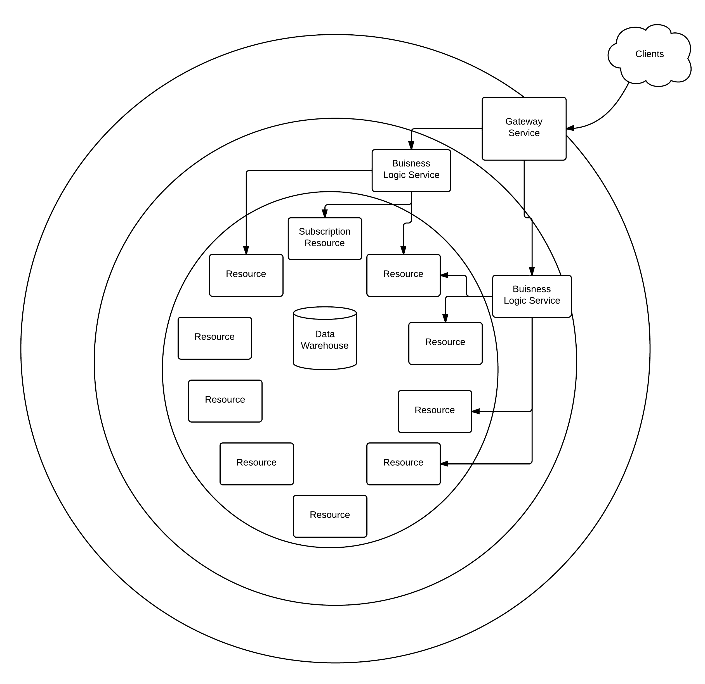

## whoami

Jeff Beck

TechLead at ReachLocal
~~~~
## What I mean by MicroService

  * Single concern
  * Deployable in isolation

~~~~
## Our Architecture

Over the course of acquisitions and expanding the products we have come out with a polyglot architecture including Java, Groovy, Ruby, PHP, Node, and PERL. In order to take advantage of our existing talent and software, we have started down the micro-service path.

~~

~~~~
## Where Grails Fits

  * REST Resources
  * GORM

~~
## Where Grails Doesn't Fit  

  * Batch Jobs
  * Lacking any web endpoint

~~~~
## Subscription Service

Acts as the source of truth about subscriptions.

  * Exposes the Subscription REST Resource
  * Emanates Events

~~
## Requirements

  * Application Monitoring
  * Security
  * Server Setup
  * Builds
  * Deployments

~~~~
## Building our Service

All our Grails micro services start out the same way.

~~
### Project Setup

  * Grails create-app
  * Change Java Version to 1.7
  * Standard Forked Mode Settings
  * Add Internal Nexus

~~
### Plugin Setup

  * Add our normal plugins
  * Remove the extra standard plugins
  * Set up cucumber
  * Configure GORM

~~
### Build and Repo Setup

  * Commit everything as the starting point
  * Add the new CI job
  * Bring up a dev server

~~~~
## Customizing our Service

We add scenarios, using cucumber allows us to keep our testing more DRY.

~~

	Scenario: Get nonexistent subscription by ID
	 Given I am a valid api client
	 And A valid subscription ID which does not match any subscription
	 When I request a subscription by ID
	 Then I get a 404 response

~~

	Scenario: Get existing subscription by ID
	 Given I am a valid api client
	 And A valid subscription ID which matches a subscription
	 When I request a subscription by ID
	 Then I get a 200 response

~~

	Given(~'^A valid subscription ID which matches a subscription$') { ->
		//Have a valid subscription which exposes an ID
	}
	Given(~'^A valid subscription ID which does not match any subscription$') { ->
		//Have an ID which is valid but no matching subscription
	}
	When(~'^I request a subscription by ID$') { ->
		//Do actual request
	}
	Then(~'^I get a (\\d+) response$') { int statusCode ->
		if (response.statusCode != statusCode) {
			println response.asString()
		}

		assert response.statusCode == statusCode
	}

~~~~
## What we reused

  * Health Checks
  * Security
  * Server Setup
  * Deployments
  * SI Components

~~~~
## Health Checks

To support reusable monitoring we expose a health check in a known way that attempts to be both human readable and programmatically useful.

~~
### Example

_Status Code_ 200
```
	{
	  "dependencies": {
	    "database":"OK",
	    "file-access":"WARN"
	  }
	}
```
~~
### What was exposed

Via a Grails plugin we share

  * Common healthcheck implementations
  * A registry of healthchecks
  * Controller that supports the expected output

~~~~
## Security

We do server to server authentication with a token. So checking the `Authorization` header the plugin authenticates a client.

~~
### Our Plugin

  * Expects a known GORM object that has an ID which is the token.
  * Uses a static list of resoure names to secure
  * Intended to be as light weight as possible

~~
### Experiences with our plugin

  * Moving away from our custom implementation towards a SpringSecurity grails plugin
  * Was opt in security which was easy to miss a controller
  * Intently lacked roles which we have found a use-case for now

~~~~
## How we shared the Plugins

We use an internal Nexus repo, and release plugins to that.

~~
### Experiences

* Supports Versioning
* Dependency resolution works the way the rest of Grails does
* Changes don't reload

~~
### Guide for Internal Plugins

  * Tend to adding features allowing customization.
  * Each plugin is a project it needs CI, CodeNarc, etc
  * Use Versioning
  * CI pushing out SNAPSHOT versions is very helpful

~~~~
## Server Setup

We use puppet to automate our server setup. Using classes we share default setup for a Tomcat server.

~~
## init.pp
```
	class apps_subscription_api (
	 $heap_min = '256m',
	 $heap_max = '1024m',
	 $permgen_size = '1024m'
	){
	 class { 'standard_tomcat7_web_server':
	 minimum_heap => $heap_min,
	 maximum_heap => $heap_max,
	 permgen_size => $permgen_size,
	 }

	 include apps_subscription_api::config

	 base::nagios::hostgroup { "rsubscription_api_servers": }
	 base::nagios::hostparam { "_healthuri": value => '/health' }
	}
```
~~
## config.pp
```
	class apps_subscription_api::config {

	 file { '/rl/path/configs/subscription-config.groovy':
	  ensure => present,
	  owner => tomcat7,
	  group     => tomcat7,
	  mode      => '0400',
	  content   => template('apps_subscription_api/subscription-config.groovy.erb'),
	  require   => File['/rl/path/configs']
	  }
	}
```
~~~~
## Deployments

We automate our deployments via custom bash scripts kicked off by bamboo deployments.

~~
## Changes per Service

  * Server List
  * Artifact Name
  * Deployment permissions

~~~~
## Spring Integration Components

Our spring integration apps tend to need the same filters and transformers for our Events. Grails apps are not the only users of these components.

~~
### Shared via a JAR

  * Exposes a Pojo that represents our internal idea of an Event
  * De-duplication filter
  * Built to include the least dependencies

~~~~
## Logging

As a single request can spread out across the graph of micro services it is helpful to have some way to correlating all the work back together.

~~
## Correlation ID

We use Log4J's MDC to log a correlation ID throughout the requests life in Grails.

```groovy
MDC.put('correlationId', ", CorrelationId=${correlationId}")
```
[Grails Filter](https://gist.github.com/beckje01/4893d073cac399228f45)

```groovy
new EnhancedPatternLayout(conversionPattern: ' %d{ISO8601}%d{ z}{GMT+0} %-5p [%t] %c{2}(:%L) - %m%X{correlationId}%n')
```

~~
## Log Aggregation

We use Splunk for log aggregation for all applications. Allowing a query across many apps for a single correlation id.

~~~~
## Centralized Monitoring

 * Nagios
 * NewRelic
 * Starting to use dashboards of health checks

~~~~
## Pitfalls

  * Poor communications between teams gets worse
  * Coordinating Releases
  * Development to spec vs finished service
  * Leaving in -SNAPSHOT dependencies
  * Poor monitoring in lower than production environments

~~~~
## MicroService Checklist

  * Low overhead to start new projects
  * Internal maven repo
  * Automated deployments
  * Server configuration management
  * Good team to team communication

~~~~
## Open Questions

  * Correct size of microservices
  * Pure REST vs RESTful
  * Security: Centralized vs Decentralized
