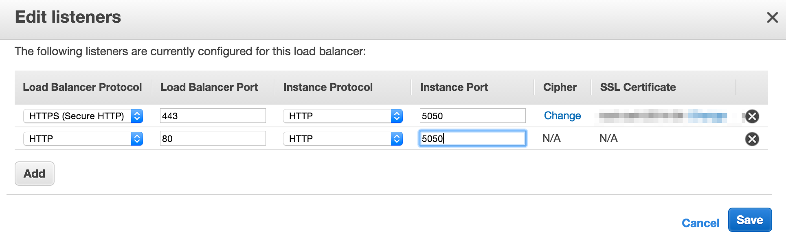

## Agenda
  * whoami
  * Simple Handler Example
  * Force SSL
  * Ratpack Sessions
  * Pac4j and Ratpack
----
## $ whoami

Jeff Beck

Engineer at SmartThings

-note
Abstract

So you are all excited about this hot framework Ratpack now you are about ready to launch into production. But you need security, I will go over using pac4j with Ratpack to secure your application. Showing integrations with Twitter, Basic Auth, and others. I will also go over a case study of CellarHQ and their security in Ratpack.

----
## Ratpack Version Note

This talk and slides are targeted at Ratpack v0.9.19-SNAPSHOT

----
## Simple Handler

Specify a handler at the start of the chain that all request will go through.

```groovy
handlers{
  all {
    //All traffic hits this handler first
  }
}
```

-note
We can provide a simple handler at the start of the chain that intercepts all traffic and checks for security concerns.

--
## Simple Handler

```groovy
all {
  if (request.headers['Authorization'] != "Token faketoken") {
    response.status(401)
    //We must send some response or the request will hang.
    response.send()
  } else {
    //We can choose to do nothing but allow the next handler in the chain to deal with the request.
    next()
  }
}
```

-note
Here we are actually checking a token now its a simple hard coded value but you could at this point easily do a check against a DB or other datastore.

--
## When This Falls Short

 * Identities
 * Roles / Authorization
 * Mixed Secure / Insecure Content
 * Multiple Authentication Options

--
## When This Works

 * Stateless MicroService
 * Prototyping

----
 ## Force SSL

 ```groovy
 all {
   if (!checkForSSL) {
       redirect(301, request.rawUri)
   }
   next()
 }
 ```

-note
 AWS Headers: http://docs.aws.amazon.com/ElasticLoadBalancing/latest/DeveloperGuide/TerminologyandKeyConcepts.html#x-forwarded-headers

--
 ## AWS Example

Using the ELB for SSL termination, we can easily detect if the request was made with https.

```
request.headers.get('X-Forwarded-Proto') != 'https'
```
--



----
## Ratpack Sessions

The `Session` module provides the basics of sessions as well as a in memory data store.

```
compile ratpack.dependency('session')
```

--
## Session Module

The SessionModule will make sure every request is set up with a session. Also by default provide an in memory session data store.

```groovy
bindings {
  module SessionModule
}
```
--
## Interact with the Session
```
def session = context.get(Session)

//Get Session ID
String sessionId = session.id

//Terminate Session
session.terminate().then()
```
//TODO LINK TO Session Code Branch

-note

Terminate the session is an Operation so you need to call then() or then {}

----
## ClientSideSession

An encrypted cookie that stores session data.

Use the [ClientSideSessionModule](http://ratpack.io/manual/0.9.19/api/index.html?ratpack/session/clientside/ClientSideSessionModule.html)

```groovy
bindings {
  module(ClientSideSessionModule, { config ->
    config.setSessionCookieName("s1")
    config.setSecretToken("fakeToken")
  })
}
```

--
## Advantages

 * No extra infrastructure to support shared sessions.
 * Encrypted so the session data can't be messed with.

--
## Disadvantages

 * Max cookie size
 * More data transfer every request
 * Requires managing a key

----
## Providing a SessionStore

You can easily change out the session store by providing an implementation of the [SessionStore](http://ratpack.io/manual/0.9.19/api/index.html?ratpack/session/SessionStore.html) interface.

```groovy
protected void configure() {
  bind(SessionStore).to(YourSessionStore).in(Singleton);
}
```
-note
Example of a redis SessionStore or other in host needs.
----
## Pac4j

There is a Pac4j [class](http://ratpack.io/manual/0.9.19/api/index.html?ratpack/pac4j/RatpackPac4j.html) that ties Pac4j into Ratpack well providing some basics you can extend.

--
## What has changed

 * No more Authorizer
 * No more guice module

----
## BasicAuth Example

build.gradle
```groovy
compile ratpack.dependency('pac4j')
compile "org.pac4j:pac4j-http:1.7.0"
```
--

```groovy
handlers{
  all(RatpackPac4j.authenticator(
    new BasicAuthClient(
      new SimpleTestUsernamePasswordAuthenticator(),
      new UsernameProfileCreator())))

  prefix("auth"){
    //Require all requests past this point to have auth.
    all(RatpackPac4j.requireAuth(BasicAuthClient))
    get{
      render "An authenticated page."
    }
  }
}
```

----
## Twitter Auth Example
----
## With multiple clients
----
## Limit client to a path
----
// Mention open sourced: CellarHQ
