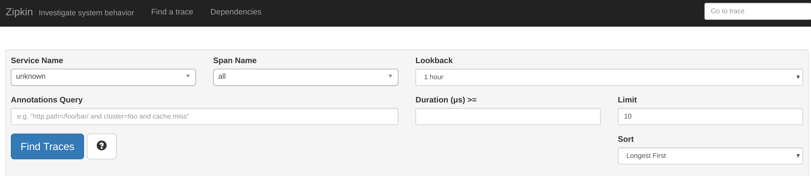
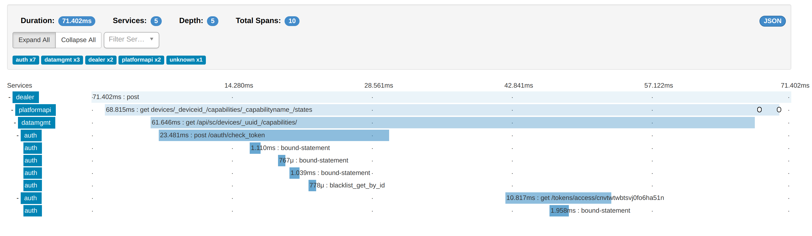
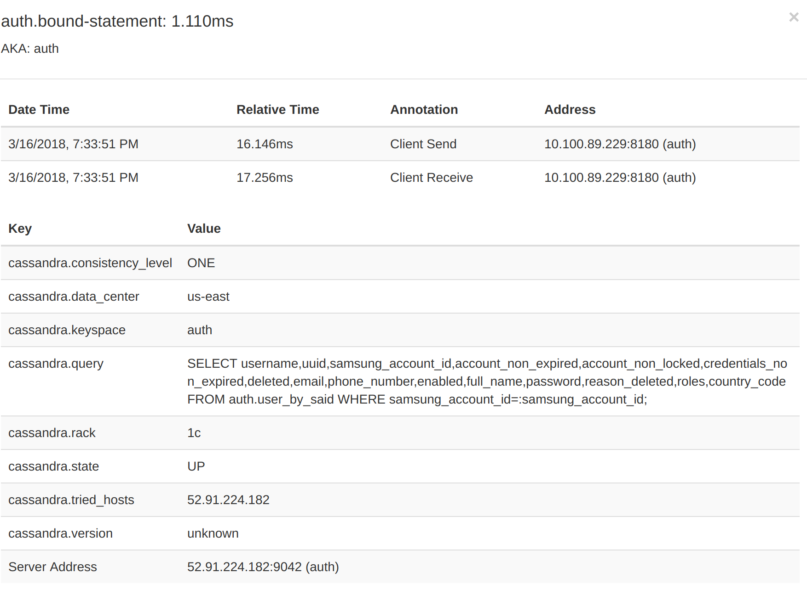
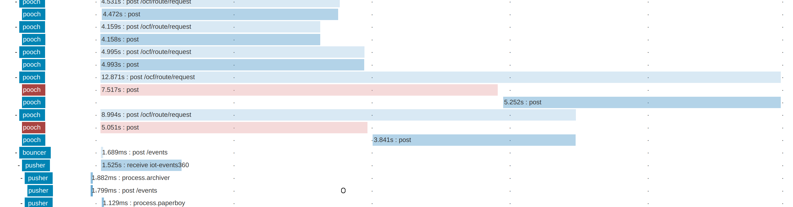
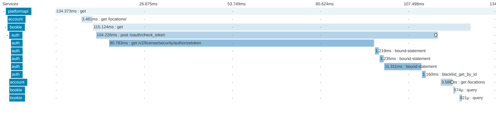

## Agenda

* whoami
* What is Distributed Tracing
* Terminology Lesson
* What is Zipkin
* How data flows between services
* How data gets to Zipkin
* App Setup
* Debug Example
* Mobile/External Clients 
* How often to sample

-note
Abstract
As the complexity of our systems grow so must our tooling, Zipkin is a great distributed tracing tool that helps deal with tracing in microservices. But once we have to tool in place how do we actually fix problems in our system? We have been using zipkin in production at SmartThings so I’m going to share our insights.

In this talk we will review how to get quickly get zipkin tracing added to Ratpack and Grails then actually go through debugging some issues. We will also cover strategies for interactions with mobile / external clients and how to figure out an amount to sample at.

No zipkin experience required.


**Other uses for tracing:**
functional tests
show arch
track calls to deprecated services

----
## $ whoami

Jeff Beck

Software Architect at SmartThings

----
## What is Distributed Tracing

Distributed tracing systems collect end-to-end latency graphs
(traces) in near real-time.

* [Zipkin](https://zipkin.io/)
* [Jaeger](https://github.com/jaegertracing/jaeger)
* [Dapper](https://research.google.com/pubs/pub36356.html)

----
## Terminology Lesson

* **Span** - An operation that took place.
* **Event** - Something that occurs in a span.
* **Tag** - Key value pair on a span.

---

* **Trace** - End-to-end latency graph, made up of spans.
* **Tracer** - Library that records spans and passes context
* **Instrumentation** - Use of a tracer to record tasks.
* **Sample %** - How often to record a trace.

----
## What is Zipkin

Zipkin mostly means the backend server that collects and surfaces trace data. 

---
## OpenZipkin

The OpenZipkin GitHub group holds many great tools such as the java tracer brave. 

OpenZipkin https://github.com/openzipkin/

---
## Zipkin Screens



---



---



----
## How Data flows between services

Service to Service the tracer deals with propagating trace info.

HTTP for example uses known Headers. [B3](https://github.com/openzipkin/b3-propagation)

----
## How data gets to Zipkin

The tracer reports all the details of a span to the Zipkin backend.

HTTP calls by default.

---
## Other Options

To get data to the Zipkin backend you have many options besides HTTP.

* SQS
* Kinesis
* Kafka
* Rabbit
* Scribe

-note
Many more for particular clouds

---
## What We Use

AWS SQS it provides an easy to operate system that we are ok with the lag introduced. Also if the collectors can't keep up we can hold the data in the queue while we add capacity.

----
## App Setup

We are going to focus on simple sending via HTTP to zipkin these can be changed out for something like SQS sender.

---
## Quick Local Zipkin

```bash
docker run --name zipkin  -d -p 9411:9411 openzipkin/zipkin
docker inspect zipkin
```

* UI: http://{ip}:9411/zipkin
* API: http://{ip}:9411/

----
## Ratpack Setup

Use the community lib [ratpack-zipkin](https://github.com/hyleung/ratpack-zipkin)

```groovy
bindings {
  //...
  moduleConfig(ServerTracingModule, 
    serverConfig.get('/zipkin', ServerTracingConfig)
    .toConfig()
    .spanReporter(AsyncReporter.create(
      OkHttpSender.create("http://192.16.10.1:9411/api/v2/spans")
    ))
  )
  //...
}
```
---
## Config

```yaml
zipkin:
  serviceName: myService
  sampleRate: 1.0
```

---
## Tag A Span

```
spanCustomizer.tag("user.username", user.getUserName());
```

_SpanCustomizer_ provided by ServerTracingModule via guice.

----
## Grails Setup

Use [Sleuth](https://github.com/spring-cloud/spring-cloud-sleuth)

Distributed tracing built into Spring Cloud works well with boot.

**Note** Grails 3.x must use Sleuth 1.3.2 or less.

---
## Grails Setup

```groovy
compile "org.springframework.cloud:spring-cloud-sleuth-core:1.3.2.RELEASE"
compile "org.springframework.cloud:spring-cloud-sleuth-zipkin:1.3.2.RELEASE"
```

**Note** Incompatible with grails cache plugin.

---

```yaml
spring:
    sleuth:
        sampler:
          percentage: 1.0
    zipkin:
        baseUrl: http://192.168.10.1:9411/
sample:
  zipkin:
    # When enabled=false, traces log to the console. Comment to send to zipkin
    enabled: true
```

----
## Micronaut Setup

```bash
mn create-app --features tracing-zipkin app-example
```
OR

```groovy
compile "io.opentracing.brave:brave-opentracing:0.30.0"

runtime "io.micronaut:tracing"
runtime "io.zipkin.brave:brave-instrumentation-http:4.19.0"
runtime "io.zipkin.reporter2:zipkin-reporter:2.5.0"
```    
---

```yaml
tracing:
  zipkin:
    enabled: true
    http:
      url: http://192.168.11.2:9411
      sampler:
        probability: 1.0
```

----
## Debug Example

Where am I getting connection timeouts.

```
http.status_code=408
```

-note 
https://tracing.smartthingstlm.com/zipkin/traces/db31eb275a0c3c90


A few errors
https://tracing.smartthingstlm.com/zipkin/traces/c32ceceb0a8cbb41

---
## Result Found



----
## Debug Example

Where is the system just slow.

```
Duration > 10000
```

**Note** Duration is in microseconds.
-note 
https://tracing.smartthingstlm.com/zipkin/traces/db31eb275a0c3c90
---
## Result Found



----
## Debug Example

Where are we doing extra data store work.

```
Select Service
```

---
## Debug Result


----
## Debugging Annotations

Search either the key=value OR key

---

* http.path=/v2/license/security/authorizeToken
* error
* http.status_code=408
* kafka.partition=70

----
## Debugging - TraceId

Log your trace id so you can jump to the trace in zipkin if you see something in logs.


----
## Mobile/External Clients 

Outside partners or clients can pass in the B3 headers as well as have the clients themselves report to zipkin directly.

---

Danger area if you allow the external system to set the trace id they may never properly change it. 

----
## How Often to Sample

* How often is it called?
* How important is the call?

---
## Example Samples

Low frequency call on account migration, but very important.

So we trace 100% in this case.

---
## Example Samples

High frequency call of device data updates. 

Trace at 1% given the frequency of the request call and how long we want to keep traces this is what our infra can handle.

----
## Questions

----
## Extra Reading

* [Zipkin Issues in GitHub](https://github.com/openzipkin/zipkin/issues)
* [Zipkin Gitter](https://gitter.im/openzipkin/zipkin)
* [Zipkin Architecture](https://zipkin.io/pages/architecture.html)
* [Sleuth Project Page](https://cloud.spring.io/spring-cloud-sleuth/)

----
## Scratch Project

A simple project to act as a scratch area to try zipkin hands on.

[http://bit.ly/2LrYmHX](http://bit.ly/2LrYmHX)

