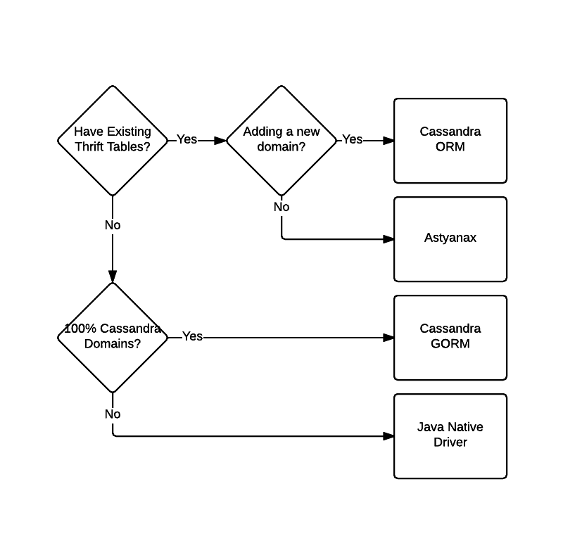

## Agenda

 * whoami
 * What is Cassandra
 * Data Modeling
 * What is Available for Grails
  * Cassandra ORM
  * Cassandra GORM
  * Astyanax
  * Java Native Driver
 * Which to Use
 * Basic Configuration


-note
Abstract

As our applications grow and need to deal with new big data challenges and global distribution we look to new data stores designed to deal with these new challenges. Cassandra is one great tool to deal with both of these problems, we will go over some of the different ways of dealing with Cassandra from Grails. I will cover the various Cassandra plugins for grails, including the Cassandra ORM, Astyanax, and Cassandra GORM. Also, I will talk about using the Cassandra Java driver directly.

By the end of the talk you should have a overview of the data modeling that will working well in Cassandra paired with Grails, when to use or not use each plugin, and some of the basic connection configuration details needed.

----
## $ whoami

Jeff Beck

Engineer at SmartThings

-note
I've been doing Cassandra for the last 3 years, production around 2 - 2 and a half years.

----
## What is Cassandra

  * Highly-Available, Distributed, Tuned Consistency
  * Master-less Replication
  * Redundancy Configurable
  * Cluster can span DCs

--
## When Cassandra

 * High write throughput needs
 * Cross datacenter replication required
 * Mature data access patterns
--
## When Not Cassandra

 * When you depend on transactions
 * Not sure how you will access the data
 * Lack the shared responsibility on the running of Cassandra

-note

You probably don't need transactions but its a different mindset check out Steve's talks about event sourcing.
----
## Data Modeling

It's hard you are going to make mistakes.

-note

No really you are going to do things wrong for a while, I still do.

--
## Data Modeling

 * You need to focus on _Fan Out on Write_, not the more traditional _Fan Out on Read_.
 * With Cassandra you really need to focus on the query not the thing being represented

--
### Hints

   * Duplicate Data
   * Good Compound Primary Key
   * Careful around adding an index
   * Hire a Consultant

--
## Primary Key

  * Defined as `PRIMARY KEY (lastName,firstName)`
  * Can query parts going left to right but no skipping.


----
## Data Modeling Example

Store every login and login attempt to the system. We want to find all attempts per user for either successful or unsuccessful sorted by the date it happened.

--
## Via CQL

```
CREATE TABLE LoginAttempts (
  userName text,
  successful boolean,
  ipAddress text,
  userAgent text,
  method text,
  dateCreated timestamp,

  PRIMARY KEY(userName, successful, dateCreated)
);
```
-note
Talk to the sorting by dateCreated or by getting all by username.

----
## Idempotent Upserts

Model your interactions as all idempotent upserts if possible. This is kind of the best case for Cassandra.

-note
Talk about how read before write is bad.

----
## What is available for Grails

  * *ORMs*
    * [Cassandra ORM](https://grails.org/plugin/cassandra-orm)
    * [Cassandra GORM](https://grails.org/plugin/cassandra)
  * *Direct Cassandra Access*
    * [Astyanax Plugin](https://grails.org/plugin/cassandra-astyanax)
    * [Java Native Driver](https://github.com/datastax/java-driver)
-note
ORMs with Cassandra while handy are something to be slightly weary of, since Cassandra dosen't have relations built in, there may be a bit of a mismatch between any ORM and Cassandra.
----
## Cassandra ORM

The older of the two ORMs this was modeled after GORM but doesn't fully participate in GORM. Based on top of Astyanax and Thrift. Provides many nice features out of the box that make get something woking very quickly.

--
## Advantages

 * Counters
 * Indices
 * Relations
 * Expando map

--
## Drawbacks

 * Dealing with bootstrapping
 * Based on Thrift
 * Only easy data access is via the application

--
## Example of Object

```groovy
class AppScheduledEventHistory {
	UUID id
	String shard
	String appId
	Date scheduledTime
	Long executionTime
	AppScheduledEventStatus executionStatus

	static cassandraMapping = [
    unindexedPrimaryKey: "id",
    explicitIndexes: [ ["appId"],
      ["scheduledEventId"],
      ["timeBucket","shard"],
      ["timeBucket","shard","executionStatus"]
    ],
    counters: [
    	[groupBy: ["scheduledTime","shard","executionStatus"]]
    ]
  ]  
}
```

--
## Example of Query

```groovy
AppScheduledEventHistory.get(params.id.toUUID())

AppScheduledEventHistory.findAllByAppId(appId)

AppScheduledEventHistory.findAllByTimeBucketAndShard(timeBucket, shard)
```
--
## More Complex Query

```groovy
AppScheduledEventHistory.findAllByTimeBucketAndShardAndExecutionStatus(
			params.timeBucket,
			params.id,
			params.status,
			[consistencyLevel: scheduledEventService.consistencyLevel])
```

--
## Using Counters

```groovy
AppScheduledEventHistory.getCountsGroupByScheduledTimeAndShardAndExecutionStatus(
			start: start,
			finish: finish,
			reversed: true,
			consistencyLevel: scheduledEventService.consistencyLevel)
```
--
## Expando Map

```groovy
class DeviceData {
	String deviceId
	Map data

	static cassandraMapping = [
			unindexedPrimaryKey: "deviceId",
			expandoMap         : "data"
	]
}
```

--
## Using Expando Map

```
def d = new DeviceData()

d.first = 'Bob'
d.last = 'Dole'

d.save()
```

----
## Cassandra GORM

A true GORM implementation for Cassandra based on Spring Datas Cassandra work which under the covers uses the Java Native Driver. It is relatively new, so there are rough edges.

--
## Advantages

  * Participates in GORM
  * Can auto create the schema
  * Same GORM syntax
--
## Drawbacks

  * Allows use of Cassandra secondary indices
  * All or nothing mapping*

-note
All or nothing mapping is just implementation currently it could be updated so this isn't a requirement.

--
## Example of Object
```groovy
class Subscription {
	UUID id
	URI product
	Date startDate
	State state
	Date endDate

	static mapping = {
    table "subscription"
		id generator: 'assigned'
		version false
	}

	static constraints = {
		startDate nullable: false
		endDate nullable: true
		state nullable: false
		product nullable: false

	}
}
```
--
## Example of Query

```groovy
def subs = Subscription.get(uuid)
```
--
## Compound Key
```
class Person  {
    String lastName
    String firstName
    Integer age = 0
    String location

    static mapping = {
        id name:"lastName", primaryKey:[ordinal:0, type:"partitioned"], generator:"assigned"
        firstName index:true, primaryKey:[ordinal:1, type: "clustered"]
        age primaryKey:[ordinal:2, type: "clustered"]
        version false  
    }
}
```

--
## More Ways to Query

```
//Will work
def people = Person.findAllbyLastNameAndFirstName('Beck','Jeff')

//Will Fail
def people = Person.findAllbyFirstName('Jeff')

```

----
## Astyanax

This is a simple Grails plugin wrapping the Netflix Astyanax library. A client for working with Cassandra.

--
## Advantages

 * More direct access to Cassandra
 * Works with legacy Thrift tables
 * Provides features of modern Cassandra clients
  * Client Side Load Balancing
  * Token Aware
  * Node Discovery

--
## Drawbacks

 * A slightly outdated view of Cassandra
 * Still supported but not seeing tons of new features
 * Lots of configuration needs to get a sensible start

--
## Example Interaction

```
final SETTINGS_CF = new ColumnFamily("EventSettings", StringSerializer.get(), StringSerializer.get())

def m = astyanaxService.keyspace().prepareMutationBatch()
m.setConsistencyLevel(consistencyLevel)
m.withRow(SETTINGS_CF, "shards").putColumn(shard, DateUtils.timeStamp(date))
m.execute()
```
-note
This is a wide row model, putting many columns on the same row dynamically.
----
## Java Native Driver

The new Driver put out by DataStax for Cassandra. It doesn't have a plugin or anything yet so you must work with it directly.

--
## Advantages

  * Supports Asynchronous Calls
  * Default configuration is a sensible start
  * Under active development
  * Performance benefit for CQL prepared statements in C* 2.1+

--
## Drawbacks

  * Low level
  * Have to wire up and manage all your own connections

--
## My Pattern using it in Grails

```
class CQLSessionService implements InitializingBean {
  //...

  @Override
  void afterPropertiesSet() throws Exception {
  	keyspace = grailsApplication.config.astyanax.defaultKeyspace
  	def clusterBuilder = new Cluster.Builder()
  			.withRetryPolicy(DowngradingConsistencyRetryPolicy.INSTANCE)
  			.withLoadBalancingPolicy(new TokenAwarePolicy(new DCAwareRoundRobinPolicy()))
  			.withReconnectionPolicy(new ConstantReconnectionPolicy(100L))
  			.withSocketOptions(new SocketOptions().setKeepAlive(true))

    def contacts = ["192.168.0.1","192.168.0.3"]
  	contacts.each { String contact ->
  		clusterBuilder.addContactPoint(contact)
  	}

  	cluster = clusterBuilder.build()
  	cluster.getConfiguration()
  	session = cluster.connect()
  }
}
```
--
## Using the SessionService

```
class LoginAttemptService {
	def CQLSessionService

	static transactional = false

	private final String tableName = "LoginAttempts"
	private PreparedStatement login_attempt_insert

	@PostConstruct
	private void prepareStatements() {
		def session = CQLSessionService.session
		def keyspace = CQLSessionService.keyspace

		login_attempt_insert = session.prepare("""INSERT INTO ${keyspace}.${tableName}
	 		(userName, successful, ipAddress, userAgent, method, dateCreated) VALUES ( ?, ?, ?, ?, ?, ?);""")
	}
}
```

----
## Which to Use

-note
If thrift use astyanax or ORM
If CQL and 100% data model is there use C* GORM
If mixed use try the Java Native driver first.

----
## Basic Config

 * Seeds
 * Token Aware
 * DC Aware
 * Retries
