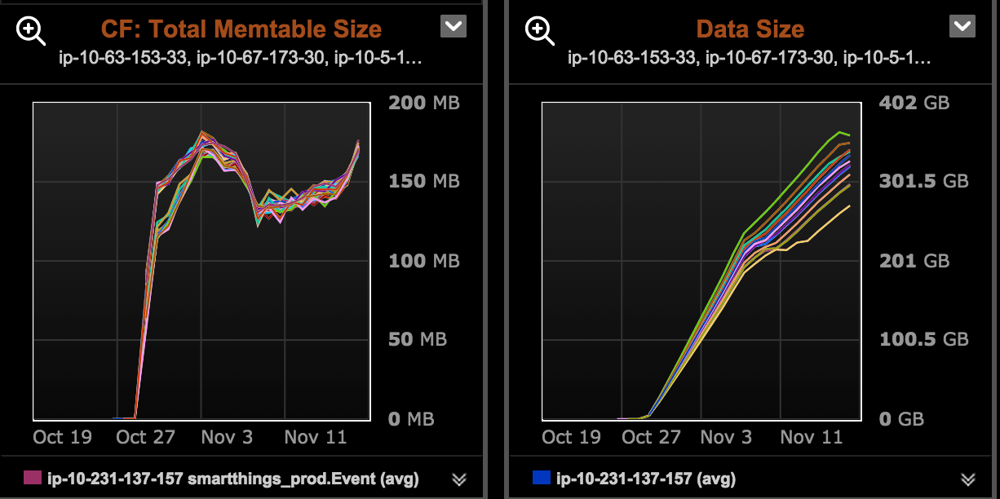
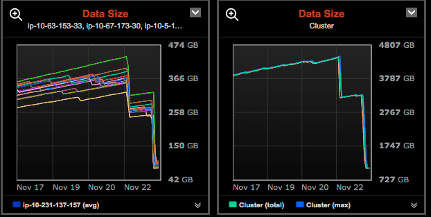
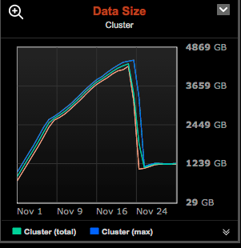

## Compaction Strategies

 * STCS - SizeTieredCompactionStrategy
 * LCS - LeveledCompactionStrategy
 * DTCS - DateTieredCompactionStrategy

~~~~
## STCS

 * The default compaction strategy.
 * Tuned to write performance.

~~~~
## LCS

 * Tuned to more consistent read latency.
 * At most 10% space wasted by obsolete rows.

~~
### Before LCS

~~
### After LCS

~~
### Overall

~~
### Link

 * [When to Use Leveled Compaction](http://www.datastax.com/dev/blog/when-to-use-leveled-compaction)

~~~~
## DTCS

 * New in 2.0.11 and 2.1.1 [CASSANDRA-6602](https://issues.apache.org/jira/browse/CASSANDRA-6602)
 * Takes advantage of special properties of time series data.

~~
### Danger Areas

 * Its very new
 * Out of order writes

~~
## Links

 * [DateTieredCompactionStrategy: Compaction for Time Series Data](http://www.datastax.com/dev/blog/datetieredcompactionstrategy)
 * [Commit](http://mail-archives.apache.org/mod_mbox/cassandra-commits/201410.mbox/%3C2881973245e0473191fba2656a4112be@git.apache.org%3E)
