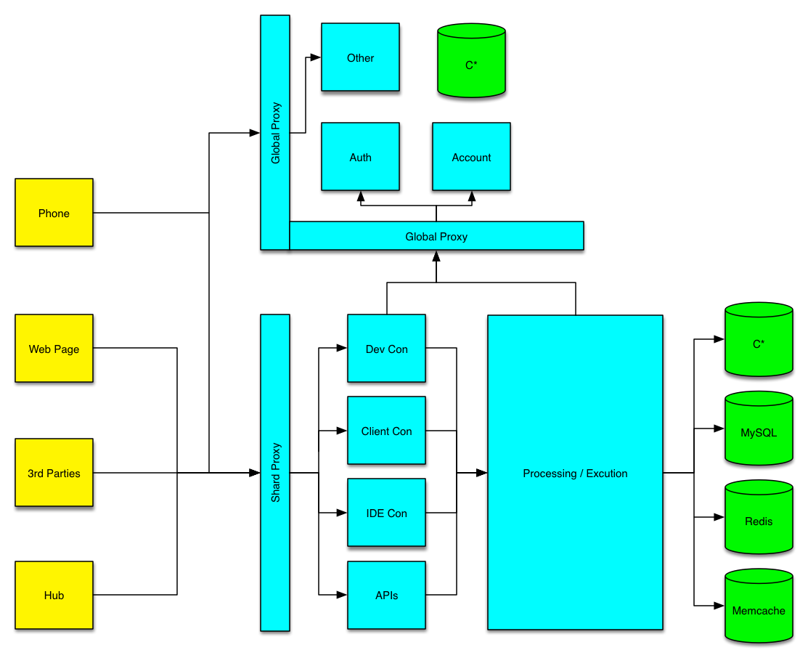
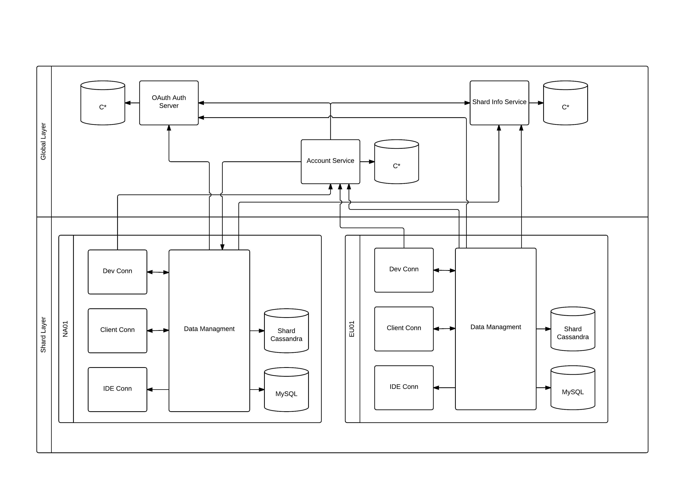

## Agenda

  * whoami
  * Big Picture
  * Data Stores
  * Backend
  * AWS
  * Messaging
  * Questions

----
## $ whoami

Jeff Beck

Software Architect at SmartThings

@beckje01

----
## Big Picture

--
## More Cloud Detail

----
## Data Stores

Data Stores not just Databases.

--
## MySQL

 * _What_ - Traditional RDBMS, SQL
 * _Why_ - Easy to start, ad-hoc queries, familiar to many, read replicas
 * _Where_ - In shard, listing of devices, groups
 * _Drawbacks_ - HA harder to do, Schema changes cause long locks, scaling harder

--
## MySQL Read Replica

* _What_ - ReadOnly of MySQL
* _Why_ - Allows read heavy workload to target different servers
* _Where_ - Paired with our MySQL
* _Drawbacks_ - Can lag, more complicated to reason about

--
## Cassandra

* _What_ - NoSQL datastore, with tunable consistency
* _Why_ - Linear scaling, global distribution, HA
* _Where_ - Global and Shard, non relational data, time series
* _Drawbacks_ - Have to know data access, operationally hard, hard to reason about

--
## Redis

* _What_ - Cache, ObjectStore
* _Why_ - Good at set operations, TTL works well
* _Where_ - In Shard around knowing who is connected in a time window
* _Drawbacks_ - Harder for HA, Scaling only via vertical and sharding, cache bugs

--
## Memcached

* _What_ - Cache
* _Why_ - Good support, very performant, ketama hashing support
* _Where_ - In shard in front of most MySQL reads
* _Drawbacks_ - Failure scenarios with hashing harder to reason about, cache bugs

----
## Backend

What frameworks we are using.

--
## Grails 2.x

* _What_ - Full MVC framework Groovy, inspired by Rails
* _Why_ - Quick dev time, strong libraries for most needs
* _Where_ - In Shard, Legacy Monolith
* _Drawbacks_ - Dated, does everything, Deploys on tomcat

--
## Grails 3.x

* _What_ - Full MVC framework Groovy, built on top of Spring Boot
* _Why_ - Easy way to work with Spring, lots of mature libraries
* _Where_ - Global Auth
* _Drawbacks_ - Slow to boot, Spring, Heavy

--
## Vertx

* _What_ - Netty Based, event driven, nonblocking
* _Why_ - Works well with raw sockets, scales well
* _Where_ - In shard connectivity to Clients and Hubs
* _Drawbacks_ - Designed around verticals, harder to reason about being nonblocking, harder operationally, opinionated

--
## Ratpack

* _What_ - Netty based, highly scalable, nonblocking, async focused micro framework
* _Why_ - Great scaling, fast starting, light weight
* _Where_ - Global and Shard, backed by Cassandra or coordinating other rest calls.
* _Drawbacks_ - Hard to reason about async, nonblocking, light documentation

--
## Dropwizard

* _What_ - Lightweight java framework
* _Why_ - Works with with messaging, light, fat jar deployment
* _Where_ - In shard, runs scheduling, some new micro services
* _Drawbacks_ - Opinionated, Jetty backed

----
## AWS

We use number of AWS specific techs to get things done.

--
## S3

* _What_ - File Storage
* _Why_ - Easy setup, little maintenance
* _Where_ - All over to store images, videos etc
* _Drawbacks_ - Blackbox

--
## ELB

* _What_ - Load balancer
* _Why_ - Easily ties into all our app deployments, scales itself
* _Where_ - In front of every app server
* _Drawbacks_ - Blackbox, limited health checking, scales on its own

--
## Route 53

* _What_ - DNS host
* _Why_ - Support Global load balancing, easy to maintain with terraform
* _Where_ - All our DNS
* _Drawbacks_ - Limited to the features offered

----
## Messaging

Queue systems to pass info between apps.

--
## RabbitMQ

* _What_ - Erlang based message queue
* _Why_ - highly scalable, proven tech
* _Where_ - Between connectivity and processing layers in shard
* _Drawbacks_ - Erlang operations not well known, Hard to configure correctly for HA

--
## Kafka

* _What_ - Message system
* _Why_ - High scaling, good throughput, persistent
* _Where_ - Secondary processing of events
* _Drawbacks_ - Lots of rough edges to understand, immature

----
## Questions
